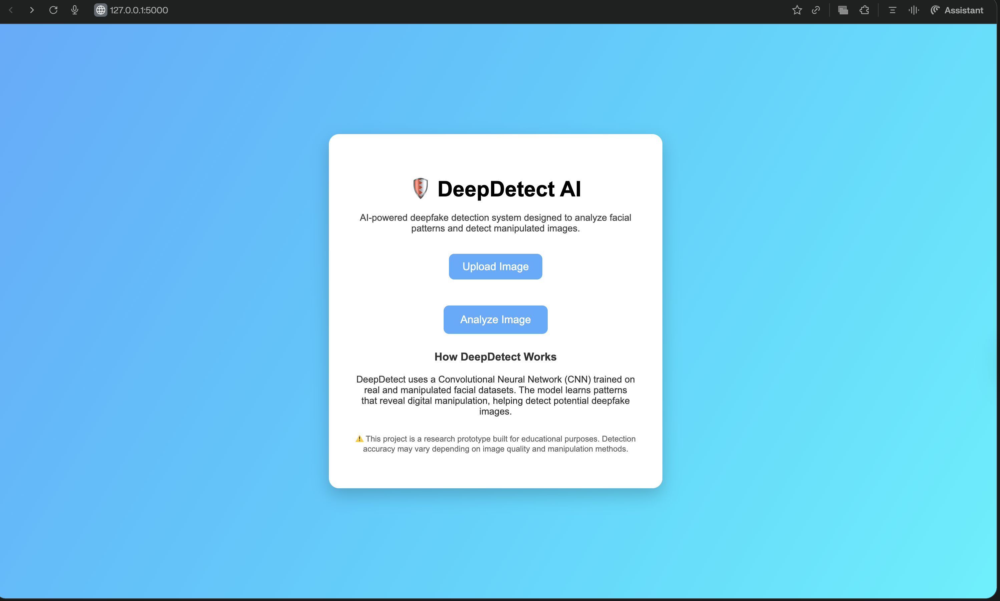
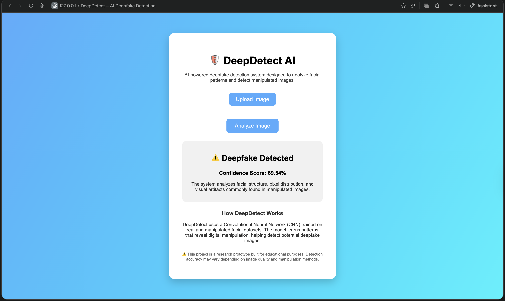

# DeepDetect – AI Deepfake Detection System

DeepDetect is an AI-powered web application that analyzes facial patterns in images to detect potential deepfake manipulations.

The system uses deep learning techniques and a Convolutional Neural Network (CNN) to analyze facial structures, pixel distribution, and visual artifacts commonly found in manipulated images.

---

## Technologies Used

- Python
- Flask
- HTML / CSS
- Deep Learning (CNN)
- OpenCV

---

## Features

- Upload an image through a simple web interface
- Analyze facial structures and image artifacts
- Detect whether an image is **Authentic** or **Deepfake**
- Display confidence score for prediction
- Clean and user-friendly UI

---

## Project Interface

### Home Page

---

### Upload Image

---

### Detection Result

---

## How DeepDetect Works

1. User uploads an image through the web interface.
2. The image is processed using OpenCV.
3. The trained CNN model analyzes facial structures.
4. The system predicts whether the image is **Real or Deepfake**.
5. The prediction confidence score is displayed.

---

## Example Output

✔ Authentic Image  
⚠ Deepfake Detected  

The system provides a **confidence score** indicating prediction reliability.

---

## Author

Santhosh Kumar Gangavaram  
B.Tech Computer Science  
AWS Certified Solutions Architect – Associate
